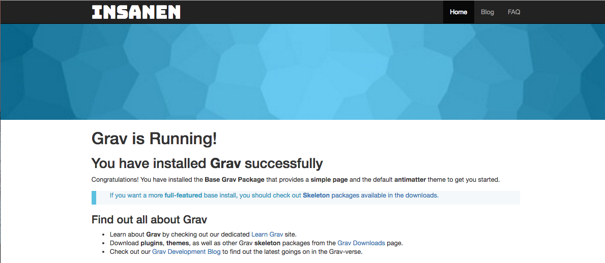

# Grav-Theme-Insanen
Grav, A Modern Source Flat File CMS theme by MisterZik & Insanen Team.

Grav-Theme-Insanen Aka Insanen theme for GravCMS.

# Features

* Professional user interface
* Responsive and mobile friendly
* Lightweight and fast loading
* Vibrant and clean typography
* Modern browser compatible
* Infinitely and extensively customizable
* Sleek interaction and smooth scrolling
* Usage Of Latest Technology: HTML5, CSS3, JavaScript, Bootstrap 3 framework.

# Installation

## GPM Installation (Preferred)

The simplest way to install this theme is via the [Grav Package Manager (GPM)](http://learn.getgrav.org/advanced/grav-gpm) through your terminal.  From the root of your Grav install type:

    bin/gpm install coming-soon

This will install the Gateway theme into your `/user/themes` directory within Grav. Its files can be found under `/your/site/grav/user/themes/insanen`.

## Manual Installation

To install this theme, just download the zip version of this repository and unzip it under `/your/site/grav/user/themes`. Then, rename the folder to `insanen`.

You should now have all the theme files under

    /your/site/grav/user/themes/insanen

## Required Plugins:

* [coming-soon](https://github.com/getgrav/)

# Setup

If you want to set Insanen Theme as the default theme, you can do so by following these steps:

* Navigate to `/your/site/grav/user/config`.
* Open the **system.yaml** file.
* Change the `theme:` setting to `theme: insanen`.
* Save your changes.
* Clear the Grav Cache. The simplest way to do this is by going to the root Grav directory in Terminal and typing `bin/grav clear-cache`.

Once this is done, you should be able to see the new theme on the front-end.
